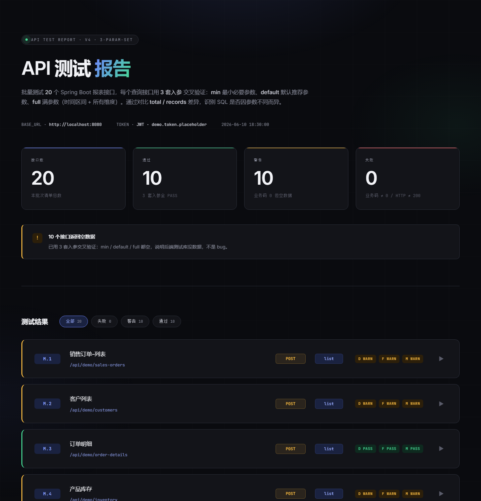
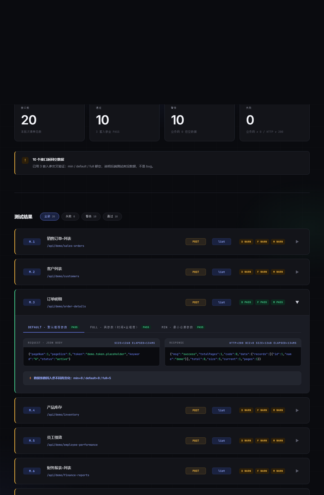

# springboot-api-test-workflow

> 批量跑 Spring Boot 报表接口 · 3 套入参交叉验证 · 单文件 HTML 报告 · 真服务测试（绝无 mock）

[](https://nodejs.org)
[](LICENSE)
[](https://github.com/)

---

## 报告长这样

**Hero — 顶部全貌**



**展开某条 episode — 3 套入参 tab + 真实 REQUEST/RESPONSE + ⚡ 数据条数对比**



**全长 — 20 个 episode 全展示**


---

## 是什么

一个 [Codex CLI skill](https://github.com/openai/codex)，给**真在跑的 Spring Boot 服务**做接口批量测试，跑完出一个**单文件 HTML 报告**（双击直接打开，无任何外部依赖）。

不是单元测试，不是 mock 自测，是**真打后端 51 次**（17 查询 × 3 套入参 + 2 详情/柏拉图 × 3 + 9 导出 × 2）。

## 4 大特点

1. **3 套入参交叉验证** — 每个查询接口跑 `min`（最小）/ `default`（默认）/ `full`（满参数）三套入参，**对比 total/records 差异**，自动判断"参数是否影响 SQL"
2. **1 行 1 接口** — 20 episode（9 POST 列表 + 2 GET 详情/柏拉图 + 9 GET 导出），**点开展开看 3 套入参的入参/出参**
3. **真实数据透明** — token 不脱敏直接显示，size/elapsed/biz 都用蓝色提亮
4. **设计已固化** — POST 琥珀 / GET 青绿 / 状态实色，每跑一次 UI 都一样

---

## 5 步快速跑起来

### 1. 装环境

- Spring Boot 服务**已经跑起来**（不是本 skill 的事）
- Node 24+ / npm 11+
- 拿到 ① **baseUrl** ② **token** ③ **接口清单**（md/表格/文字都行）

### 2. 摸鉴权位置（5 分钟）

按 5 个位置依次试，**不要一开始就怀疑 token 过期**：

| 顺序 | 位置 | 怎么打 |
|---|---|---|
| ① | 请求体 body (json 字段) | `POST` body 加 `"token": "<user_token>"` |
| ② | 请求头 Authorization | `Authorization: Bearer <user_token>"` |
| ③ | 请求头 X-Token / token | `token: <user_token>"`（不带 Bearer） |
| ④ | Cookie | `Cookie: JSESSIONID=xxx; token=xxx` |
| ⑤ | Query String | `?token=<user_token>"`（GET 常见） |

**判断成功标志**：响应里**业务码 = 0** + 有数据。**不是** 401 / code=10。

### 3. 填 token（两种方式）

**方式 A · 环境变量（推荐）**：

```bash
# Windows PowerShell
$env:TEST_TOKEN = "eyJ0eXAiOiJKV1Q..."

# macOS / Linux
export TEST_TOKEN="eyJ0eXAiOiJKV1Q..."
```

**方式 B · 直接改 probe.js**（不推荐，会泄露）：

```js
// 顶部那行
const TOKEN = process.env.TEST_TOKEN || 'eyJ0eXAiOiJKV1Q...';
```

> 警告：不要把带真 token 的 probe.js / test-report.html 提交到 git。本仓库 .gitignore 已忽略常见 token 泄露路径，但请自觉。

### 4. 跑测试

```bash
# 编辑 probe.js 顶部 3 行：OUT / BASE（TOKEN 走环境变量）
node probe.js
# 生成 probe.json（51 case / 20 episode）
```

### 5. 出报告

```bash
node inject.js probe.json report.template.html test-report.html
```

### 5. 打开报告

```bash
# Windows
start test-report.html
# macOS
open test-report.html
# Linux
xdg-open test-report.html
```

---

## 3 套入参详解

| 套 | 内容 | 用途 |
|---|---|---|
| **min** | `{ pageNum:1, pageSize:5, token }` | 验证接口最少能跑通 |
| **default** | `{ keyword:'TEST', pageNum:1, pageSize:5, token }` | 用户日常使用 |
| **full** | `{ keyword:'TEST', dateRange[2026-01-01, 2026-06-10], region, category, deptId, pageNum:1, pageSize:20, token }` | 验证 SQL 因参数不同而异 |

**对比 3 套的 total** → 自动生成 `diffNote`（大白话）：

- `数据条数因入参不同而变化：min=46 / default=46 / full=26` → 绿
- `3 套入参都查到 0 条数据（后端没数据）` → 黄
- `3 套入参都查到 N 条（参数不影响）` → 蓝

---

## 视觉编码表

| 元素 | 颜色 | 语义 |
|---|---|---|
| **POST method chip** | 琥珀 `#F4B740` | 业务写操作 |
| **GET method chip** | 青绿 `#46D893` | 数据读取 |
| **接口路径** | 淡蓝 accent-soft | 关键信息提亮 |
| **size / elapsed / biz** | 淡蓝 accent-soft | 关键指标 |
| **PASS 状态** | 实色绿 | 测试通过 |
| **WARN 状态** | 实色黄 | 空数据 / 偏小 |
| **FAIL 状态** | 实色红 | 接口异常 |
| **接口名** | 主文字白 | 主信息 |
| **kind chip** | accent-bg 紫蓝 | 维度（list / detail / chart / xls） |

**两层分开**：method 低饱和 + 边框（次要语义） vs status 高饱和 + 实色（主要语义），不会撞色。

---

## 报告结构

```
[H1] API 测试报告 (渐变)
  [sub] 批量测试 N 个 ... 3 套入参交叉验证
  [meta-row] BASE_URL · TOKEN (不脱敏) · 时间戳

[4 stat 块]
  接口数 20 | 通过 10 | 警告 10 | 失败 0

[callout] 严重问题摘要

[toolbar] 4 个 filter chip (全部 / 失败 / 警告 / 通过)

[episode list] 1 行 1 接口（20 行）
  [ep-head] id | 名字+URL | POST/GET | kind | D/F/M chip | ▶
  [ep-body] (点开展开)
    [param-tabs] DEFAULT · 默认推荐参数 | FULL · 满参数 | MIN · 最小必要参数
    [param-pane] REQUEST (左) | RESPONSE (右)  ← 双栏并排
    [diff-note] ⚡ 数据条数：min=46 / default=46 / full=26

[footer]
```

---

## 项目结构

```
springboot-api-test-workflow/
├── README.md                          ← 你正在看
├── SKILL.md                           ← Codex skill 配置入口
├── probe.js                           ← 跑 51 case（清单驱动）
├── inject.js                          ← probe.json → HTML
├── report.template.html               ← HTML 模板（固化设计）
├── test-report.html                   ← 示例输出（token 已脱敏为 <REDACTED-JWT>）
├── interfaces-mock.md                ← 示例接口清单（mock）
├── docs/
│   └── images/
│       ├── report-hero.png
│       ├── expanded-M.3.png
│       └── report-full.png
├── auth-5-positions.md                ← 鉴权 5 个位置详解
├── default-design-system.md           ← 设计 token（颜色/字体/间距）
├── self-audit-checklist.md            ← 16 条自检清单
├── newman-vs-node-raw.md              ← 为什么不用 Newman
└── what-is-mock-and-why-not.md        ← mock ≠ 真测试
```

---

## 调试踩坑（10 条）

1. **不要一开始就否认用户的 token** —— 先试 5 个鉴权位置
2. **GET 接口的 token 必须拼到 query string** —— POST 在 body 里，**两个都试**
3. **`probe.js` 里的 GET 构造必须有 `u.searchParams.set('token', token)`** —— 不然 GET 永远 401
4. **业务码解析要支持字符串** —— 后端可能 `"code": "-1"`（带引号）而不是 `"code": -1`
5. **详情接口 splitId 是必传** —— 3 套入参都必须带（v4 探针自动注入）
6. **JWT 没 exp 字段不等于 token 永久有效** —— 后端可能用 Redis 或 IP 绑定 session
7. **同一 token 不能跨 session 用** —— 拿 token 立刻连打 51 个，别分批跑
8. **导出 Excel 的 content-type 不一定是 `spreadsheetml`** —— 也可能是 `application/vnd.ms-excel`
9. **PowerShell 写 JS 文件用 `node -e` 或 `Out-File` 转义很坑** —— 用 `node script.js` 跑独立脚本最稳
10. **method chip CSS 没生效？** —— 检查 JS 里 `class="ep-method"` 是否拼接了 method 名（必须是 `class="ep-method POST"`）

---

## 自检清单（16 条）

跑完报告后过一遍：

### 报告结构
- [ ] **1 行 1 接口**（不是 1 行 1 case）
- [ ] 行内 D / F / M 三个 chip 各自带状态色
- [ ] 点开展开后，3 套入参 tab 可切换
- [ ] 每个 tab 里有 REQUEST 和 RESPONSE 双栏
- [ ] JSON 有 4 色语法高亮（key 蓝 / 字符串 绿 / 数字 黄 / null 红）

### 数据真实性
- [ ] **token 不脱敏** —— 直接显示在 meta-row 和展开的 REQUEST 里
- [ ] stat-strip 5 个数字 = `node probe.js` 跑出来的实际数（不是写死）
- [ ] callout 文案根据 FAIL/WARN/PASS 动态生成
- [ ] diff-note 正确反映"3 套入参 total 是否一致"

### 视觉
- [ ] `<html lang="zh-CN">` 设置了
- [ ] 用了 Inter + PingFang SC 字体回退
- [ ] **单一主色** `#6F86FF`
- [ ] 字号跨度 ≥ 4 倍（h1 56 → label 11）
- [ ] ep-head padding ≥ 28px 横向 / 24px 纵向（**不紧凑**）
- [ ] ep 间 gap ≥ 16px
- [ ] 状态用色块 + 左边 3px border-left，**不用 emoji**

---

## 设计模式

**单模式**（v4 起固化）：本 skill **不再检测 anti-ai-feel-design**，永远用内置的 `report.template.html` 渲染。

> 不管你电脑里装没装 anti-ai-feel-design，**报告 UI 100% 一致**。这是用户已经确认的视觉标准。

设计 token 见 `default-design-system.md`，包含：
- **颜色** accent `#6F86FF` / success `#46D893` / warn `#F4B740` / error `#FF6E6E` / POST `#F4B740` / GET `#46D893`
- **字体** Inter + Noto Sans SC + JetBrains Mono
- **字号** h1 56 / stat 56 / body 15 / label 11
- **间距** 8pt scale
- **圆角** badge 6 / card 14 / pill 999
- **装饰** dot grid 96px + 3 个 radial gradient + pulse 圆点

---

## 适用 vs 不适用

✅ **适用**：
- 报表类接口批量验证（业务/数据分析/导出）
- 想知道"参数是否真的影响 SQL"
- 想给开发/产品出一份"能点击看入参出参"的报告
- 已在开发中的 Spring Boot 项目（localhost / 内网 IP）

❌ **不适用**：
- 单元测试 —— 那是 JUnit / Mockito 范畴
- 前端 UI E2E —— 那是 Playwright 范畴
- 仅 mock 自测 —— 没真服务就别测

---

## License

MIT